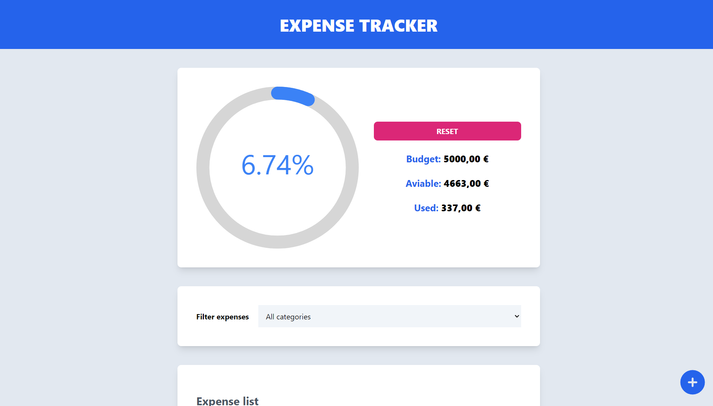
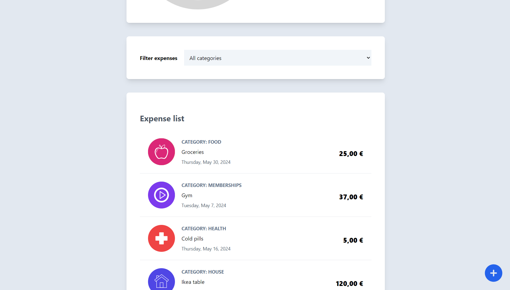

# React expense tracker
A React application for tracking expenses, featuring modular components, global state management with reducers and Context API, and responsive design. 
## Screenshots

---

## Learnings
- Global state managment with context API
- State managment with useReducer()
- NPM UI components usage
